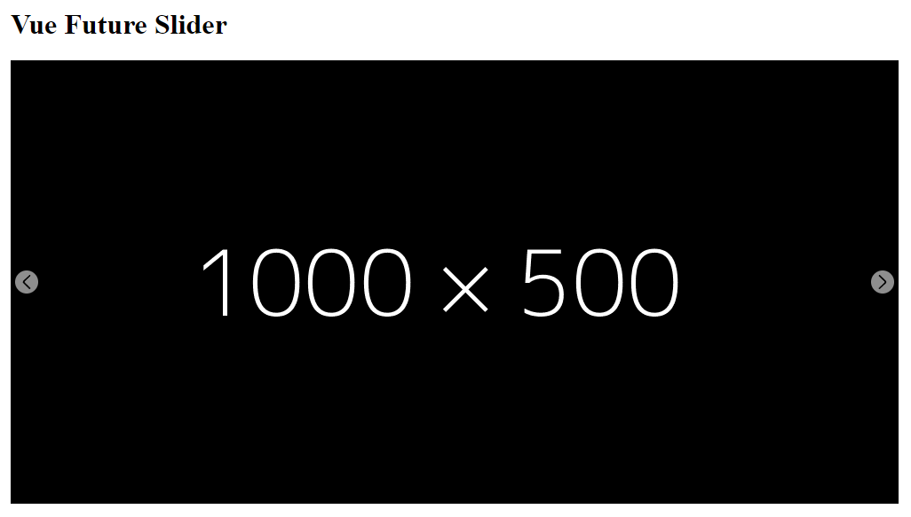

# Vue Future Slider



# Installation

```
# npm
npm i vue-future-slider
```

## Use globally
```js
import Vue from 'vue'
import FutureSlider from 'vue-future-slider'
import 'vue-future-slider/dist/vue-future-slider.css'

Vue.use(FutureSlider);
```

# Quick Start

```html
<div class="container">
    <h1>Vue Future Slider</h1>
    <div class="slider">
        <future-slider :items="images"/>
    </div>
</div>
```

```js
export default {
    name: 'App',
    data: function () {
        return {
            images: [
                {
                    image: 'https://dummyimage.com/1000x500/000/fff',
                    link: 'https://github.com/1NEAT1/vue-future-slider',
                    target: true,
                },
                {
                    image: 'https://dummyimage.com/1000x500/000e4f/000000',
                    link: 'https://github.com/1NEAT1/vue-future-slider',
                    target: false,
                },
                {
                    image: 'https://dummyimage.com/1000x500/121e1f/000000',
                    link: 'https://github.com/1NEAT1/vue-future-slider',
                    target: true,
                },
                {
                    image: 'https://dummyimage.com/1000x500/121e1f/b00000'
                }
            ]
        }
    }
}
```

```scss
.container {
  width: 1000px;
  height: 500px;
  margin-inline: auto;

  .slider {
    width: inherit;
    height: inherit;
  }
}
```

# DOCS

- [Setting Props](https://github.com/1NEAT1/vue-future-slider/blob/master/docs/api.md)


